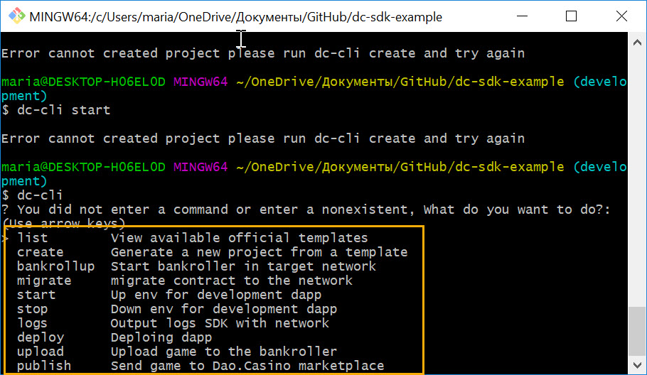

DAO.Casino provides a comprehensive gamedev kit with a sample viable game in it. 

Note that you still have to install the bankroller application (see below) to have a comprehensive SDK.

The DAO.Casino SDK contains:
- a set of files to implement the game logic and a sample of viable game for front-end developers
- bankroller application (casino backend)
- integrated smart contracts (protocol, game back-end)
- Below you can find detailed deployment guidelines.

## Note on Code
Our solution uses Solidity for smart contracts, TypeScript for core components and game logic. You may also use JavaScript in your projects. 
# Deployment

## Preconditions

The developer kit is based on truffle framework, so you need to install the following:

- node.js (1o or newer)
- npm.js

For **Windows** you need Bash Terminal with installed windows-build-tools; call: ```javascript npm install --global windows-build-tools``` and ```javascript  npm i -g node-gyp``` to compile node.js addons

For Mac OS install:xcode-select --install

For Linux install gcc utility by calling: sudo apt install gcc

For **Mac OS** install: ```javascript xcode-select --install```

For **Linux** install gcc utility by calling: ```javascriptsudo apt install g```

## DC-CLI Deployment 
You can install our wizard for easier and smoother deployment. To do it, call (wizard installation):
<!--  npm i -g dc-cli-->
```javascript
dc-cli create daocasino/dc-sdk-example ./myDapp
```
When the wizard starts, it displays the list (menu) of commands you have to call in order to successfully deploy the SDK and use it. 

The recommended procedure and command particularities are covered in a [separate chapter](2.2.%20DC-CLI%20and%20Dev%20Environment.md).


<!--
## Truffle Deployment 

Makes sure that all the above preconditions are met, initiate the command:

```javascript
mkdir ./myDapp && cd ./myDapp
truffle unbox DaoCasino/SDK && npm start
```

## Direct Deployment via Docker Container and GitHub 

To use this option, you do not need Truffle framework pre-installed (the built-in procedure deploys it automatically).

First deploy the Ethereum testrpc network with deployed DAO.Casino protocol contracts; pull at https://hub.docker.com/r/daocasino/protocol/:

1. Start `daocasino testRPC` on custom port  1406.
2. Link folder dc_contracts to build contracts info:

```javascript
docker run --name="my_dc_net" -d -p 1406:8545 -v "$PWD"/dc_contracts:/protocol daocasino/protocol

ls ./dc_contracts
```

3. Stop by the following container name:

```javascript
docker stop my_dc_net
```

4. Within the container deploy a local Ethereum network by calling:

```javascript
ganache-cli with --mnemonic="candy maple cake sugar pudding cream honey rich smooth crumble sweet treat"
```

This mnemonic is used to create 10 accounts with private keys for the local network. 

##### Predefined Accounts

(0) 0x627306090abab3a6e1400e9345bc60c78a8bef57 (~100000 ETH) 

(1) 0xf17f52151ebef6c7334fad080c5704d77216b732 (~100000 ETH) 

(2) 0xc5fdf4076b8f3a5357c5e395ab970b5b54098fef (~100000 ETH) 

(3) 0x821aea9a577a9b44299b9c15c88cf3087f3b5544 (~100000 ETH) 

(4) 0x0d1d4e623d10f9fba5db95830f7d3839406c6af2 (~100000 ETH) 

(5) 0x2932b7a2355d6fecc4b5c0b6bd44cc31df247a2e (~100000 ETH) 

(6) 0x2191ef87e392377ec08e7c08eb105ef5448eced5 (~100000 ETH) 

(7) 0x0f4f2ac550a1b4e2280d04c21cea7ebd822934b5 (~100000 ETH) 

(8) 0x6330a553fc93768f612722bb8c2ec78ac90b3bbc (~100000 ETH) 

(9) 0x5aeda56215b167893e80b4fe645ba6d5bab767de (~100000 ETH)

##### Private Keys

(0) 0xc87509a1c067bbde78beb793e6fa76530b6382a4c0241e5e4a9ec0a0f44dc0d3 

(1) 0xae6ae8e5ccbfb04590405997ee2d52d2b330726137b875053c36d94e974d162f 

(2) 0x0dbbe8e4ae425a6d2687f1a7e3ba17bc98c673636790f1b8ad91193c05875ef1 

(3) 0xc88b703fb08cbea894b6aeff5a544fb92e78a18e19814cd85da83b71f772aa6c 

(4) 0x388c684f0ba1ef5017716adb5d21a053ea8e90277d0868337519f97bede61418 

(5) 0x659cbb0e2411a44db63778987b1e22153c086a95eb6b18bdf89de078917abc63 

(6) 0x82d052c865f5763aad42add438569276c00d3d88a2d062d36b2bae914d58b8c8 

(7) 0xaa3680d5d48a8283413f7a108367c7299ca73f553735860a87b08f39395618b7 

(8) 0x0f62d96d6675f32685bbdb8ac13cda7c23436f63efbb9d07700d8669ff12b7c4 

(9) 0x8d5366123cb560bb606379f90a0bfd4769eecc0557f1b362dcae9012b548b1e5

##### Gas Limit

7992181  units

For more details on transaction prices see [the relevant section](https://github.com/DaoCasino/Documentation/2.%20Developer%20Sandbox/2.8.%20Notes%20on%20Transaction%20Pricing.md).

**Note that the accounts must be whitelisted.**

Next, deploy [bankroller core](https://github.com/DaoCasino/bankroller-core) for the bankroller node:

1. Define network settings:

```javascript
  dc_network:
    driver: bridge
```

2. Define the service settings:

```javascript
ethereum test rpc network based on ganache-cli
  dc_protocol:
    labels:
      - "TestRPC on port 1406"
      - "truffle ganache-cli"
    image:
      daocasino/protocol
    ports:
      - 1406:8545
    volumes:
      - ./protocol:/protocol
    networks:
       - dc_network
```

3. Deploy bankroller node (casino backend), note that service monitors dapp logic (reload node, if settings change). 

```javascript
dc_bankroller: 
    labels: 
      - "dapp casino backend" 
    depends_on: 
      - dc_protocol 
    build: 
     ./ 
    environment: 
       - privateKey=0x8d5366123cb560bb606379f90a0bfd4769eecc0557f1b362dcae9012b548b1e5 
    volumes: 
      - ../protocol/check_linked_contracts:/protocol 
      - ./dapps/:/bankroller/data_sdk/dapps 
    entrypoint:  
      ["sh", "./run_sdk_env.sh"] 
    networks: 
      - dc_docker_test_network
```
Note that the above code ensures that the bankroller receives the local network private key. If the bankroller fails to receive the private key, the error message with guidelines is sent in response. Bankroller node disconnects.
If you use the predefined container, no errors are expected. But mind this requirement, if you are changing the code.

#### Error message
`console.error(`Bankroller account PRIVATE_KEY required!`);
      console.info(\`set ENV variable privateKey\`);

      if (process.env.DC_NETWORK === 'ropsten') {
        console.info(`You can get account with test ETH and BETs , from our faucet https://faucet.dao.casino/ 
          or use this random ${this.web3.eth.accounts.create().privateKey} , but send Ropsten ETH and BETs for them
        `);
    
      } else if (process.env.DC_NETWORK === 'sdk') {
        console.info(`For local SDK env you can use this privkey: 0x8d5366123cb560bb606379f90a0bfd4769eecc0557f1b362dcae9012b548b1e5`);
      } else {
        console.info(`You can use this privkey: ${this.web3.eth.accounts.create().privateKey}, but be sure that account have ETH and BETs `);
      }
Then, deploy our front-end SDK from https://github.com/DaoCasino/ via GitHub clone command. Note that this part may be redundant, if you plan to start a platform, act as a bankroller, but not to develop games.
```
git clone --depth=1 https://github.com/DaoCasino/find-the-ethereum ./myDapp
cd ./myDapp
npm i && npm start
​``` 
-->
# Bankroller App Deployment

Clone the mono repository. Then call:

`npm i -g bankroller-core`

To start the application, call:

``bankroller-core start <privateKey> [options]``

## Optional Procedure for Windows

1. Install GIT Bash. Call all commands in this console. Launch it as the local administrator. 
2. Install Node.js (version 10 or newer).
3. Install Docker. If your OS is not from the Pro/Enterprise family or its version is below Windows 10, install the [Docker Toolbox](https://docs.docker.com/toolbox/overview/#whats-in-the-box).
4. Clone the DAO.Casino repository.
5. Navigate to the core repository directory and call `npm install --global windows-build-tools.` This command installs components necessary for Windows, and ```javascript  npm i -g node-gyp``` to compile node.js addons
6. Call `yarn install` in the same directory. In case of conflicts, install manually.
7. Once complete, call `yarn build`. 

All parameters are specified at ../src/bin/deamon.ts. 

## Troubleshooting 

Overall, the deployment kit is very solid and error-proof, but, If you have problems deploying the SDK, check the following:
- node.js version
- npm status
- conflicts with other networks deployed on your PC
- Internet access
- browser plugins, Windows antivirus software blocking the process
- etc.

After a series of tests, you are likely to exhaust test balances available for each account. To rest the test accounts:

in dc-cli call:

`reset`

or call:

`npm run reset`


