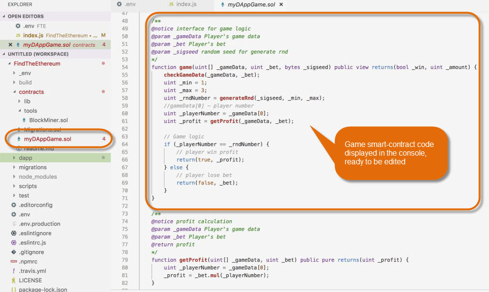
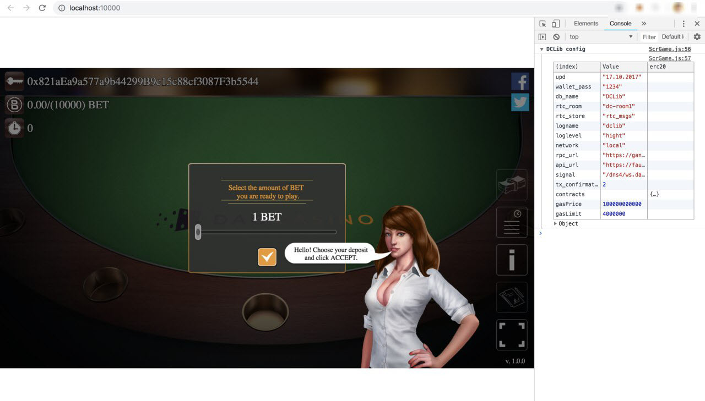

# Overview
DC-CLI is a command line wizard designed to smoothly download and deploy SDK elements for game development and deployment. The idea behind it is to reduce the number of similar manual operations (e.g. changing the same value at several points) and, subsequently, to reduce the risk of errors.

Note that you still have to install bankroller application to get a fully-fledged DAO.Casino development environment. Bankroller side is required to emulate the two-player process.

# Prerequisites:
To use the DC-CLI, you need:
- one of the recent node.js versions (10 or newer)
- npm.js
- docker-compose (optional)

Note that the whole solution has been successfully tested on .nix OS's and Mac OS. It is supposed to be compatible with Windows, but no tests have been carried out so far. You may need to install additional applications.

# Installation
To install the DC-CLI, call:

```javascript
dc-cli create daocasino/dc-sdk-example ./myDapp

```
# Commands
DC_CLI offers a list (a menu) of commands; each is responsible for a specific stage of SDK setup. There is a recommended order of commands, but it can be revised at developer's discretion, also dc-cli commands can be used separately at further stages of SDK life-cycle (e.g. to reset the environment).
## List
View the list of available Truffle templates (webpack is the default). Choose one for your project.
## Create
Use this command to create your environment based on SDK example. Enter the command as follows (where myDapp stands for your local project folder).
```javascript
dc-cli create daocasino/dc-sdk-example ./myDapp

```
Once complete, call DC-CLI again and move to the next command.   
To view logs, either use the relevant DC-CLI command, or call:
`npm run logs:bankroller`
## Bankrollup
The second command is required to start the bankroller application in the selected network.
## Migrate
This command is required to configure smart contracts.
## Start
This command starts the SDK browser console with a viable game example in it.  
Use the console to navigate between files, edit game and contract logic. 
You can also start the console directly from the folder where your project is located. Navigate to this folder and call:
<code>npm i & npm run start</code>
or
<code>yarn install & yarn start</code>

## Stop
This command stops the environment correctly. If you close the console manually, docker container will go on running in the background.
## Logs
Allows viewing performance logs of the environment.
## Build
This command compiles your contract settings for Ropsten (or other supported blockchain network) and tests it using a range of predefined accounts and keys.  

## Deploy
This command publishes your contracts to [ropsten](https://ropsten.etherscan.io) and the game logic to IPFS.  

## Publish
Makes the game available at gamemarket.  
Whenever you call a command in the DC-CLI, you call package.json file. Acting as a "dashboard", the file, in turn, calls the relevant script to execute the selected command. 

# Environment Structure
The left side of the console window displays the file structure of the SDK environment within the folder where you choose to deploy it. 
For detailed guidlines on the development process, please refer to [the relevant section](../2.%20Developer%20Sandbox/2.3.%20Game%20Dev%20Process.md).
