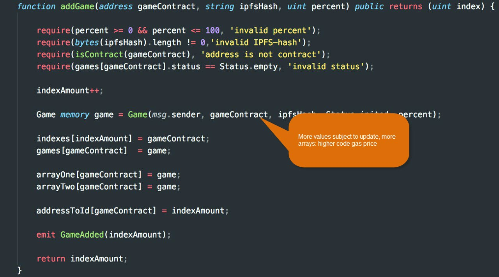
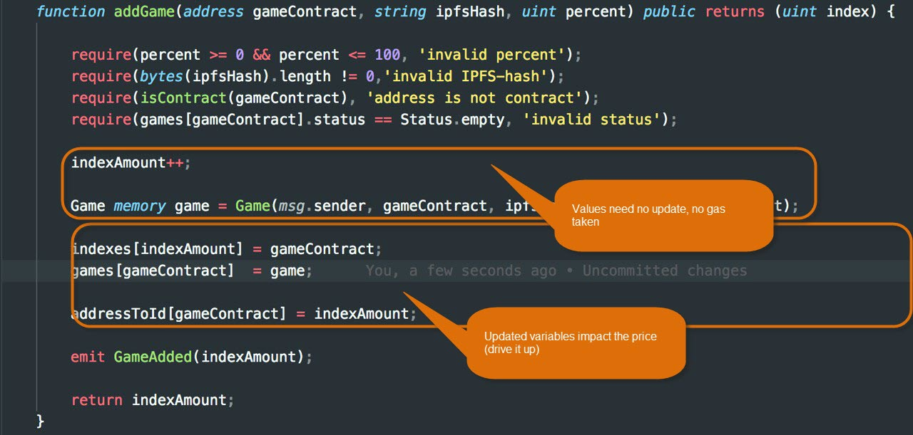

There are no hard and fast rules to forecast the gas price of a specific game logic. But there are certain code properties that have direct impact on the price. Below are two transaction examples with a two-fold price difference.

The illustrations above show transaction generation and its price. In particular, the price is impacted by the amount of values that need update and by the total code volume.

The illustrations above show a more expensive transaction and its price. We can see that this code is longer with more values that need update.

It is logical to keep the code concise, though the game pricing requirements depend on the audience ability and readiness to pay. Anyway, note that the global ERC20 limit is set at 8m units.

